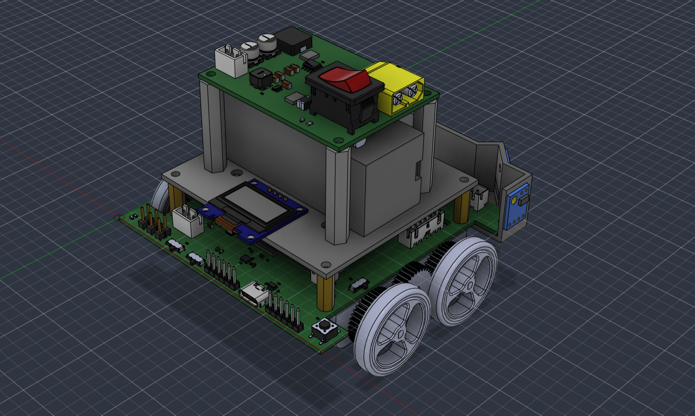
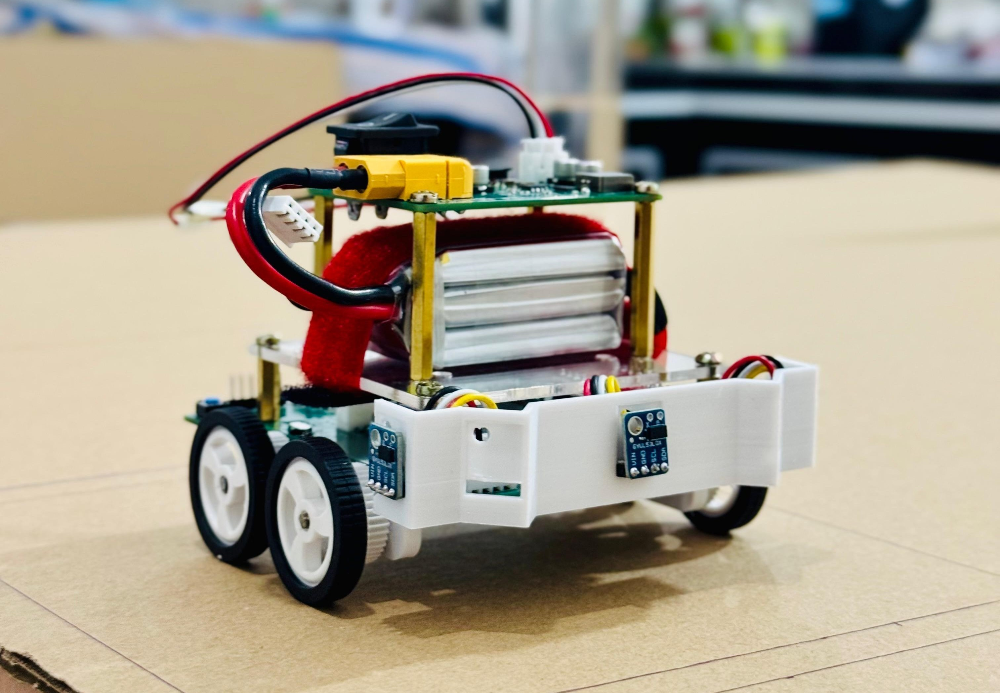

# Lolita Micromouse

<table align="center">
  <tr>
    <td align="center" valign="middle">
      
    </td>
    <td width="24"></td>
    <td align="center" valign="middle">
      
    </td>
  </tr>
</table>

## About

Lolita is a differential-drive micromouse robot built around an
**STM32F405RGT6** MCU, a 6-axis IMU, encoder-equipped DC motors, and five
VL53L0X time-of-flight sensors for wall detection. Two custom 4-layer PCBs
(a power board and a main controller board) handle regulation, sensing, and
motor drive, all housed in a custom-designed 3D-printed chassis.

The firmware runs low-level motion control — encoder-only straight-line
motion and IMU/encoder-fused turns via an EKF — as the foundation for future
maze-solving. See [`main_controller/`](main_controller) for firmware details
and [`pcb_designs/`](pcb_designs) for the electrical design.

## Workspace structure

| Folder | Contents |
|---|---|
| [`main_controller/`](main_controller) | STM32 firmware (CubeMX + HAL, CMake/Ninja build) |
| [`pcb_designs/`](pcb_designs) | Altium schematics, PCB layouts, and bring-up tests for the Power and Main PCBs |
| [`mechanical_designs/`](mechanical_designs) | Chassis and mechanical CAD |
| [`simulations/`](simulations) | Simulation work |
| [`tests/`](tests) | Project-level test resources |
| [`docs/`](docs) | Documentation assets (images, etc.) |

Each folder has its own `README.md` with further detail.

## Cloning and building

```sh
git clone git@github.com:thevinufernando/lolita_micromouse.git
cd lolita_micromouse
```

Firmware build instructions (toolchain setup, flashing, and debugging) are in
[`main_controller/README.md`](main_controller/README.md). Hardware design
files under `pcb_designs/` require [Altium Designer](https://www.altium.com/)
or the free [Altium 365 Viewer](https://www.altium.com/viewer).

## Team

- Thevinu Fernando
- Hiruna Malavipathirana
- Ishakya Ranhiru
- Chanul Nimadith

<!-- Team photo to be added -->

## License

This project is licensed under the [MIT License](LICENSE).
