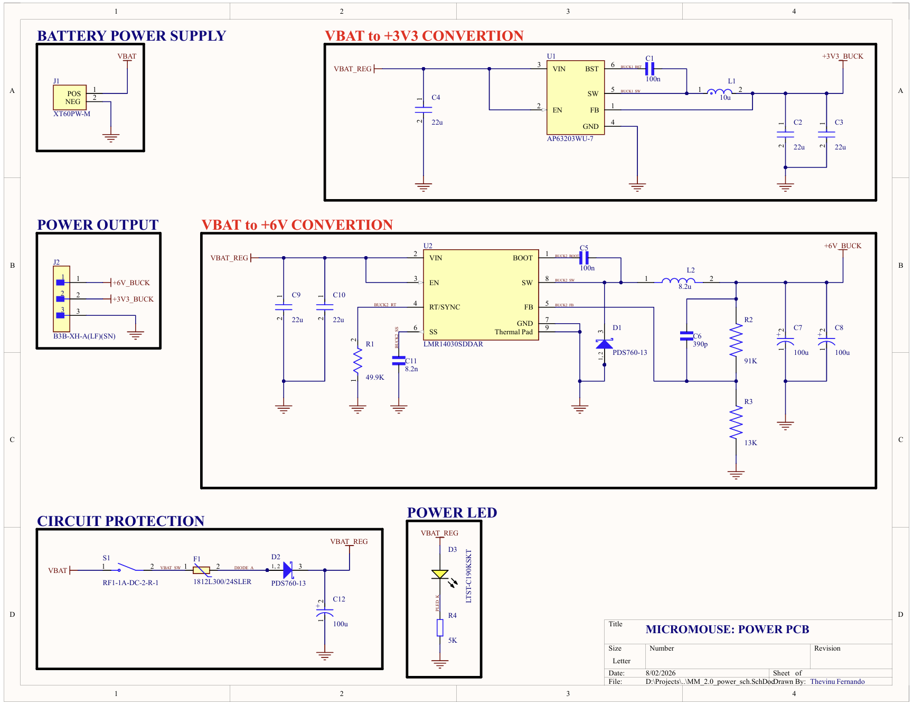
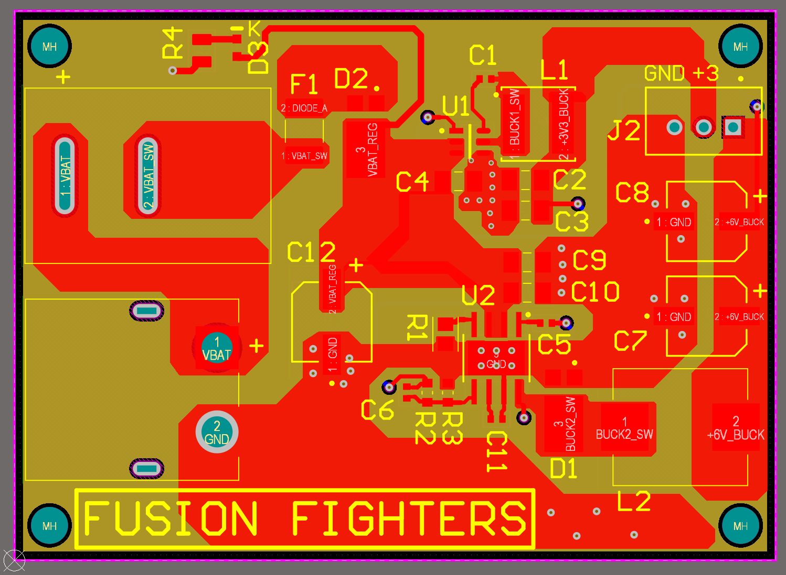
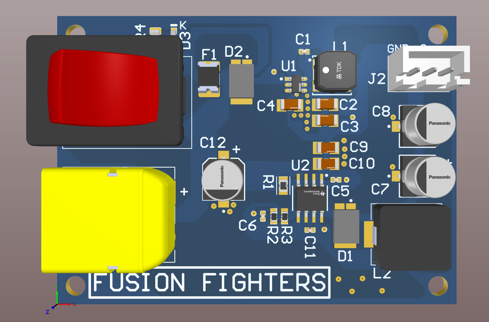
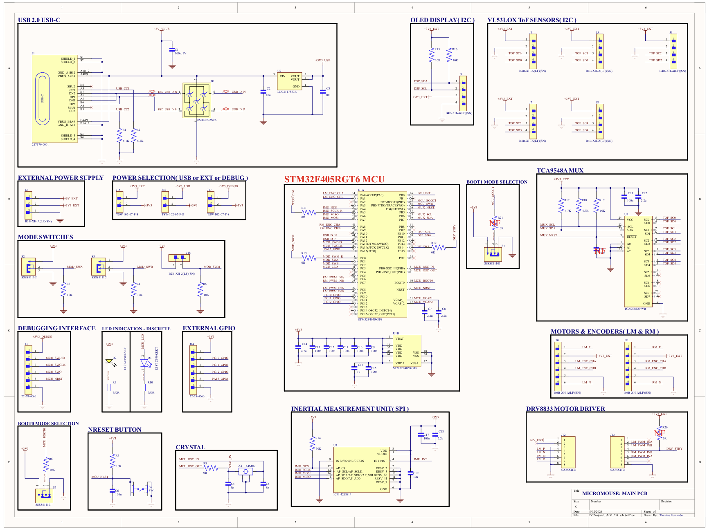
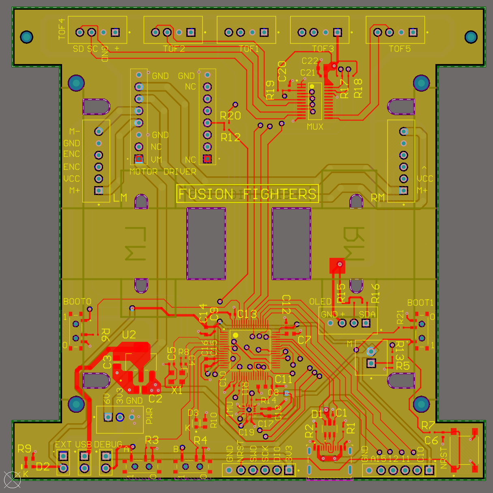
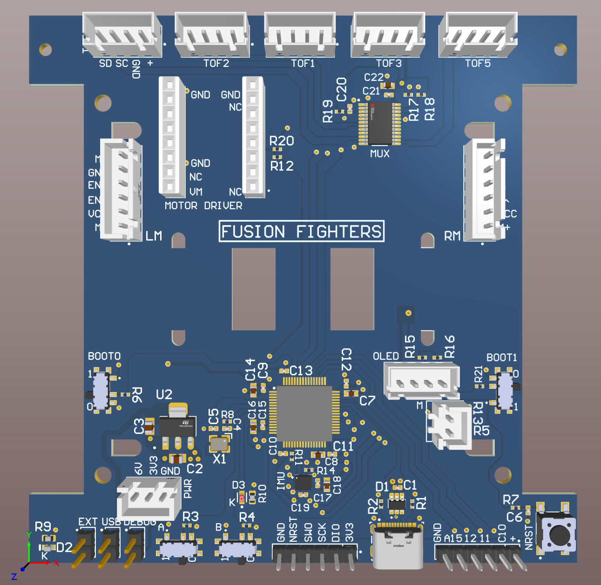

# PCB Designs

This folder contains the electrical design of the micromouse robot: schematics, PCB layouts, 3D renders, bring-up test media, and supporting design documents. The design is split into two boards — a **Power PCB** and a **Main Controller PCB** — connected by a board-to-board power harness.

All designs were done in Altium Designer. Both boards are **4-layer** PCBs.

## Folder structure

```
pcb_designs/
├── assets/                          # Schematic, layout, and 3D render images (used below)
├── docs/
│   └── LMR14030SDDAR_webench_reports/  # TI WEBENCH design reports for the 6V buck converter
├── main_PCB/
│   ├── schematics/                  # MM_2.0_sch.SchDoc + exported PDF
│   └── pcb/                         # MM_2.0_pcb.PcbDoc
├── power_PCB/
│   ├── schematics/                  # MM_2.0_power_sch.SchDoc + exported PDF
│   └── pcb/                         # MM_2.0_power_pcb.PcbDoc
└── tests/
    ├── main_PCB/                    # Bring-up photos/videos of the main PCB
    └── power_PCB/                   # Buck converter output tests (6V / 3.3V rails)
```

> Note: `.SchDoc` and `.PcbDoc` files require [Altium Designer](https://www.altium.com/) (or the free [Altium 365 Viewer](https://www.altium.com/viewer)) to open. PDF exports of the schematics are included alongside the source files for quick viewing without Altium.

## System overview

The robot is powered by a single **3S LiPO battery (11.1V nominal / 12.6V full charge)**. The Power PCB steps this down to the two rails the rest of the system needs, and the Main PCB carries the MCU, sensors, and motor drive electronics.

```
3S LiPO (12.6V) ──> Power PCB ──> +6V  (motors, via DRV8833)
                               └─> +3.3V (STM32, IMU, ToF sensors, OLED, logic)
```

---

## Power PCB

The Power PCB converts the raw battery voltage into two clean regulated rails using synchronous buck converters, with input reverse-polarity/overcurrent protection and a physical power switch.

### Key sections (see [power_PCB_sch.png](assets/power_PCB_sch.png))

| Section | Description |
|---|---|
| **Battery Power Supply** | XT60 connector (`J1`) brings in raw `VBAT` (3S LiPO, ~12.6V max). |
| **Circuit Protection** | Series power switch (`S1`), a resettable fuse (`F1`, 1812L300/24SLER) and a reverse-polarity/flyback protection diode (`D2`, PDS760-13) on the `VBAT_SW` → `VBAT_REG` path, with bulk input capacitance (`C12`). |
| **VBAT → +3.3V Conversion** | `AP63203WU-7` synchronous buck converter (`U1`) steps `VBAT_REG` down to a fixed **+3.3V** rail (`+3V3_BUCK`) for MCU/logic. |
| **VBAT → +6V Conversion** | `LMR14030SDDAR` synchronous buck converter (`U2`) steps `VBAT_REG` down to a regulated **+6V** rail (`+6V_BUCK`) for the drive motors. Output voltage is set via the `R2`/`R3` feedback divider. |
| **Power Output** | 3-pin JST connector (`J2`) exports `+6V_BUCK`, `+3V3_BUCK`, and `GND` to the Main PCB. |
| **Power LED** | `D3` indicator LED shows the board is powered from `VBAT_REG`. |

### Buck converter design notes

- **+3.3V rail — AP63203WU-7**: a simple fixed-frequency synchronous buck, chosen for the low-current 3.3V logic rail (MCU, sensors, OLED).
- **+6V rail — LMR14030SDDAR**: drives the higher-current motor rail. This converter was designed and simulated using **TI WEBENCH** — see [`docs/LMR14030SDDAR_webench_reports`](docs/LMR14030SDDAR_webench_reports) for the full design report, including:
  - `webench_sch.pdf` — WEBENCH-generated reference schematic
  - `WBDesign1_Steady State-1.pdf` — steady-state output ripple/efficiency
  - `WBDesign1_Bode Plot-2.pdf` — loop stability (gain/phase margin)
  - `WBDesign1_Startup-3.pdf` — startup/soft-start behavior
  - `WBDesign1_Input Transient-4.pdf` — response to input voltage transients

### Layout & 3D render

| Schematic | Layout | 3D View |
|---|---|---|
| [](assets/power_PCB_sch.png) | [](assets/power_PCB_layout.png) | [](assets/power_PCB_3D.png) |

### Bring-up testing

The Power PCB was bench-tested to verify both regulated rails before integrating with the Main PCB:

- [`tests/power_PCB/power_PCB_test.JPEG`](tests/power_PCB/power_PCB_test.JPEG) — test setup
- [`tests/power_PCB/6V_buck_test.MP4`](tests/power_PCB/6V_buck_test.MP4) — +6V rail verification
- [`tests/power_PCB/3.3V_buck_test.MP4`](tests/power_PCB/3.3V_buck_test.MP4) — +3.3V rail verification

---

## Main Controller PCB

The Main PCB carries the STM32F405RGT6 MCU, all sensing, motor driving, and the debug/expansion interfaces. It receives regulated +6V and +3.3V from the Power PCB.

### Key sections (see [main_PCB_sch.png](assets/main_PCB_sch.png))

| Section | Description |
|---|---|
| **MCU** | `STM32F405RGT6` (`U1A`/`U1B`) — main controller, running the firmware in [`main_controller/`](../main_controller). |
| **USB 2.0 (USB-C)** | USB-C receptacle with CC1/CC2 pull-downs for UFP detection, ESD protection (`USBLC6-2SC6`), and a `LDL1117S33R` LDO generating `+3V3_USB` for the USB PHY. |
| **Power Selection** | Jumper-selectable MCU supply source — `+3V3_USB` (from USB), `+3V3_EXT` (from the Power PCB), or `+3V3_DEBUG` (from an external debug supply). |
| **External Power Supply** | Direct `+6V_EXT` / `+3V3_EXT` input connector, for bench testing without the Power PCB. |
| **Inertial Measurement Unit** | `ICM-42688-P` 6-axis IMU (`U3`) over SPI, with its own 24MHz-independent decoupling and `IMU_INT` interrupt line to the MCU. |
| **VL53L0X ToF Sensors (I2C)** | Five VL53L0X time-of-flight distance sensors (`J4`–`J8`), one per wall-detection direction. |
| **TCA9548A I2C Mux** | 8-channel `TCA9548A` I2C multiplexer (`U4`). Since all VL53L0X units share the same default I2C address, each sensor is wired to its own mux channel so the MCU can address them individually over a single I2C bus. |
| **DRV8833 Motor Driver** | Dual H-bridge `DRV8833` driver ICs (one per motor, `J12`/`J13`) driving the left and right DC motors from the `+6V_EXT` rail, controlled via PWM from the MCU timers. |
| **Motors & Encoders (LM/RM)** | JST connectors (`J10`/`J11`) for the left/right motor + quadrature encoder channels (`ENC_CHA`/`ENC_CHB`) feeding the MCU's encoder timer inputs. |
| **OLED Display (I2C)** | 4-pin I2C header (`J9`) for a status/debug OLED. |
| **Debugging Interface** | SWD header (`J1`: `SWDIO`/`SWCLK`/`SWO`/`NRST`) for programming and debugging via ST-Link. |
| **BOOT0 / BOOT1 Mode Selection** | Slide switches to select MCU boot mode (system bootloader vs. flash) for DFU flashing. |
| **Mode Switches / External GPIO** | General-purpose slide switches (`MOD_SWA/SWB/SWM`) and a spare GPIO header (`J14`) for run-mode selection and future expansion. |
| **LED Indication** | Discrete status LEDs (`D2`/`D3`) driven directly from MCU GPIOs. |
| **Crystal / NRST / BOOT** | 24MHz HSE crystal (`X1`), reset button (`S5`), and boot-mode strapping circuitry for the MCU. |

### Layout & 3D render

| Schematic | Layout | 3D View |
|---|---|---|
| [](assets/main_PCB_sch.png) | [](assets/main_PCB_layout.png) | [](assets/main_PCB_3D.png) |

### Bring-up testing

- [`tests/main_PCB/pcb_test_img.jpg`](tests/main_PCB/pcb_test_img.jpg) — assembled board
- [`tests/main_PCB/pcb_test.MP4`](tests/main_PCB/pcb_test.MP4) — power-up / basic functionality test
- [`tests/main_PCB/main_PCB_test.MP4`](tests/main_PCB/main_PCB_test.MP4) — extended functional test

---

## Design summary

| | Power PCB | Main PCB |
|---|---|---|
| Layers | 4 | 4 |
| Input | 3S LiPO (12.6V max) via XT60 | +6V / +3.3V from Power PCB (or external/USB) |
| Output | +6V, +3.3V | — |
| Key ICs | AP63203WU-7, LMR14030SDDAR | STM32F405RGT6, ICM-42688-P, TCA9548A, 5× VL53L0X, DRV8833 ×2 |
| CAD tool | Altium Designer | Altium Designer |

## Related documentation

- Firmware for the STM32F405RGT6 running on the Main PCB: [`main_controller/`](../main_controller) (see its `CLAUDE.md` for firmware development notes — **not covered by this document**).
